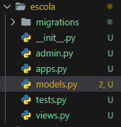

# API-Django-Python-

## Django e Django Rest

Ambos são escritos em Python, porém com finalidades diferentes. O Django facilita a construção de sites e aplicações web. Enquanto o Django Rest, é um conjunto de ferramentas poderosas para construir web APIS.


## Configurando

1° Inicialmente criamos um ambinte para manter todas as dependencias do desenvolvimento dentro.

Criamos a famosa Virtual Env, que nada mais seria que um ambinete virtual leve, onde cada um possui seu proprio pacote com conjuntos de dependencias.
```
pyton -m venv ./venv
```

2º Depois precisamos ativar nosso ambinete virtual que foi criado.

```
sintae: nome_da_virtualenv/Scripts/Activate

venv/Scripts/Activate
```

> Lembrando que o modo de ativar a .venv é diferente para cada tipo de ambinete de desenvolvimento, seja ela Linu xou Windows.

3° Baixamos todas as dependencias necessarias para o desenvolvimento.

```
pip install --upgrade pip

pip install Django
```

> Observação: Podemos dar um pip freeze para identificar quais são as dependecias para o projeto, e assim garantir que o Django foi instalado.


4º Criamos o projeto
```
django-admin startproject config .
```

> Usamos esse projeto para cria nosso projeto em si, porem como uma boa pratica nós criamos o projeto com o nome "config" e adicionamos o "." no final para garantir que dentro dessa pasta não seja criada mais nenhuma subpasta. Fazemos isso pois o Django admin é responsavel por todas as configurações da nossa aplicação

Após esses passos a estrutura de pastas deve ficar nesse formato. Deve conter nossa virtuual machine, nosso projeto com a config e nosso arquivo manager.s
<div align="center"></div>

5° Iniciando o servidor
```
python manage.py runservers
```


------------------------

## Desenvolvendo com Django

> Podemos modificar a linguagem e o time zone nas configs do projeto.

> Automaticamente o Django tem um banco configurado para si mesmo.

1° Após fazer toda nossa configuração e ligar nosso servidor, é necessário que criemos um projeto e estartemos ele.

```
python manage.py startapp "nome_projeto"

python manage.py startapp escola
```

> Precisamos estar com o ambiente virtual ligado para fazermos isso.

<div align="center"></div>

2° Criar modelo de aluno e migra-lo para o banco de dados. Então vamos até o script "models" quue achamos no nosso projeto escola e criamos um script.

```
class Aluno(models.Model) :
    nome = models.CharField(max_length=30)
    rg = models.CharField(max_length=9)

    def __str__(self) -> str:
        return self.nome

Nela especificamos que nosso modelo espera receber nome e rg, cada uma com sua especificação, e irá identificar-los pelo nome.
```

3° Após criar o modelo, é necessário que exportemos essa informação para o banco de dados criado pelo Django. Para fazer isso temos que ir até o arquivo "conf" que temos e incluir o nome do projeto no "INSTALLED_APPS", e após iniciarmos a migração com o código:
```
//Copdigo para identificar migração
python manage.py makemigrations

//Código para fazer a migração
python manage.py migrate
```

> Caso não venhamos a fazer essa modificação, ao rodar o código, não será encontrado migração para fazer.

<br/> 

4° Após fazermos isso, podemos utiliza-lo e fazer cadastros, até mesmo para que possamos testar se está tudo certo. Então podemos ir até o admin.py do projeto escola.

Ao me encontrar no arquivo podemos começar:
```
// Importamos o modelo que criamos
from escola.models import Aluno

//Criamos uma class para as informações
class Alunos(admin.ModelAdmin): 
        //O que será retornado
    list_display = ('id', 'nome', 'rg')
        //O que pode ser modificado pelo usuário
    list_display_links = ('id', 'nome')
        //O que pode ser usado como metodo de busca
    search_fields = ('nome')
```

<div align="center"></div>

<br/> 
Ao tentar acessar essas informações, nós vemos que é solicitado um login que não foi configurado, então temos que configurar.
```
python manage.py createsuperuser
```

Dessa forma teremos acesso a interface grafica de configuração do Django. Porém ainda não temos acesso as configurações de "Alunso" pois ainda não configuramos no admin.py

```
admin.site.register(Aluno, Alunos)
```

Ao acessar podemos através da interface grafica podemos adicionar usuário, editar, excluir.

<br/>

## Desenvolvendo com Django Rest Framework

